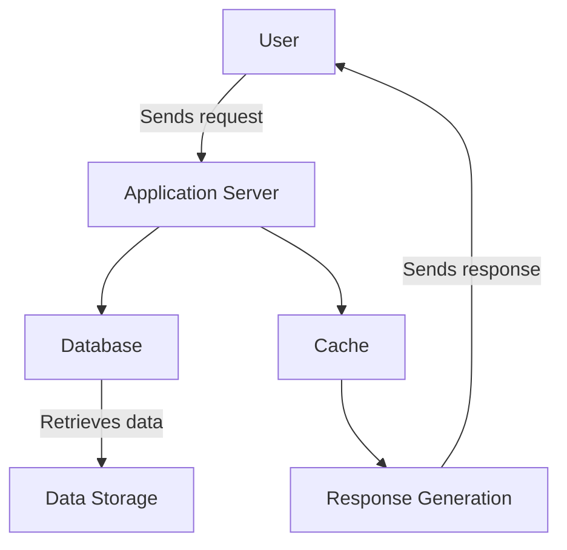

```mermaid

graph TD;
    A[User] -->|Sends request| B[Application Server];
    B --> C[Database];
    B --> D[Cache];
    C -->|Retrieves data| E[Data Storage];
    D --> F[Response Generation];
    F -->|Sends response| A;
```